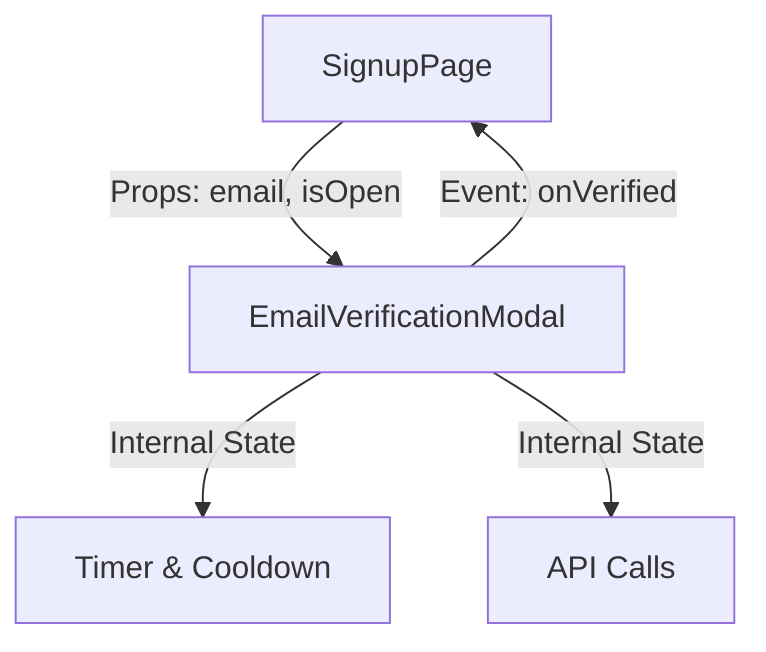

# 회원가입 모듈화 전략: 이메일 인증 (Email Verification)

## 1. 개요
회원가입 프로세스의 복잡도를 낮추고 유지보수성을 높이기 위해, **이메일 인증 기능**을 독립적인 모달 컴포넌트로 분리하는 모듈화 전략을 채택했습니다. 이를 통해 메인 회원가입 폼의 비대화를 막고, 인증 로직을 캡슐화했습니다.

## 2. 모듈화 구조 (Component Architecture)

### 2.1 구조도


### 2.2 역할 분담
| 컴포넌트 | 역할 | 주요 책임 |
|----------|------|-----------|
| **SignupPage** | Container | - 전체 회원가입 폼 데이터 관리<br>- 이메일 인증 모달의 표시 여부(`isOpen`) 제어<br>- 최종 인증 완료 상태(`isEmailVerified`) 관리<br>- 인증 미완료 시 가입 차단 |
| **EmailVerificationModal** | Presentational & Logic | - 인증 코드 발송/재발송 로직<br>- 인증 코드 입력 및 검증<br>- **타이머(3분) 및 쿨다운(60초)** 상태 관리<br>- UI 렌더링 (모달, 로딩, 에러 메시지) |

## 3. 상세 구현 내용

### 3.1 EmailVerificationModal (`src/components/auth/EmailVerificationModal.tsx`)
독립적인 인증 흐름을 담당하는 컴포넌트입니다.

- **Props Interface**:
  ```typescript
  interface EmailVerificationModalProps {
      isOpen: boolean;      // 모달 표시 여부
      onClose: () => void;  // 모달 닫기 핸들러
      email: string;        // 인증할 이메일 주소 (Read-only)
      onVerified: () => void; // 인증 성공 시 부모에게 알리는 콜백
  }
  ```
- **주요 기능**:
  - **Step 관리**: `SEND` (발송 전/대기) -> `VERIFY` (코드 입력)
  - **타이머**: `setInterval`을 사용한 180초(3분) 카운트다운
  - **쿨다운**: 재발송 버튼에 60초 쿨다운 적용
  - **UX**: Glassmorphism 디자인, 로딩 인디케이터, 에러 메시지 표시

### 3.2 SignupPage (`src/pages/SignupPage.tsx`)
모달을 통합하고 전체 흐름을 제어합니다.

- **상태 관리**:
  ```typescript
  const [isEmailVerificationModalOpen, setIsEmailVerificationModalOpen] = useState(false);
  const [isEmailVerified, setIsEmailVerified] = useState(false);
  ```
- **연동 로직**:
  1. 사용자가 이메일 입력 후 [인증하기] 버튼 클릭
  2. `EmailVerificationModal` 오픈
  3. 모달 내에서 인증 성공 시 `onVerified` 콜백 실행
  4. `isEmailVerified`를 `true`로 설정하고 [인증 완료] 상태로 UI 변경
  5. 이메일 수정 시 `isEmailVerified`를 다시 `false`로 초기화하여 재인증 강제

## 4. 비즈니스 로직 반영 (Business Logic)

백엔드 API 명세에 따른 제약 사항을 프론트엔드 UI/UX에 반영했습니다.

- **유효 시간**: 3분 (180초) 타이머 표시, 시간 만료 시 입력 차단
- **재발송 쿨다운**: 60초 동안 재발송 버튼 비활성화
- **시도 횟수 제한**: 5회 제한 및 30분 차단 정책에 대한 안내 문구(Warning Box) 추가

## 5. 향후 과제 (TODO)

현재는 UI 및 로직 흐름만 구현되어 있으며, 실제 백엔드 통신 부분은 Mocking 되어 있습니다.

- [ ] **API 연동**: `axios` 또는 커스텀 훅을 사용하여 실제 엔드포인트 연결
  - 발송: `POST /api/auth/email/send-verification`
  - 검증: `POST /api/auth/email/verify`
- [ ] **에러 핸들링**: 
  - 429 (Too Many Requests) 응답 시 쿨다운 처리
  - 403 (Forbidden) 응답 시 30분 차단 메시지 표시
